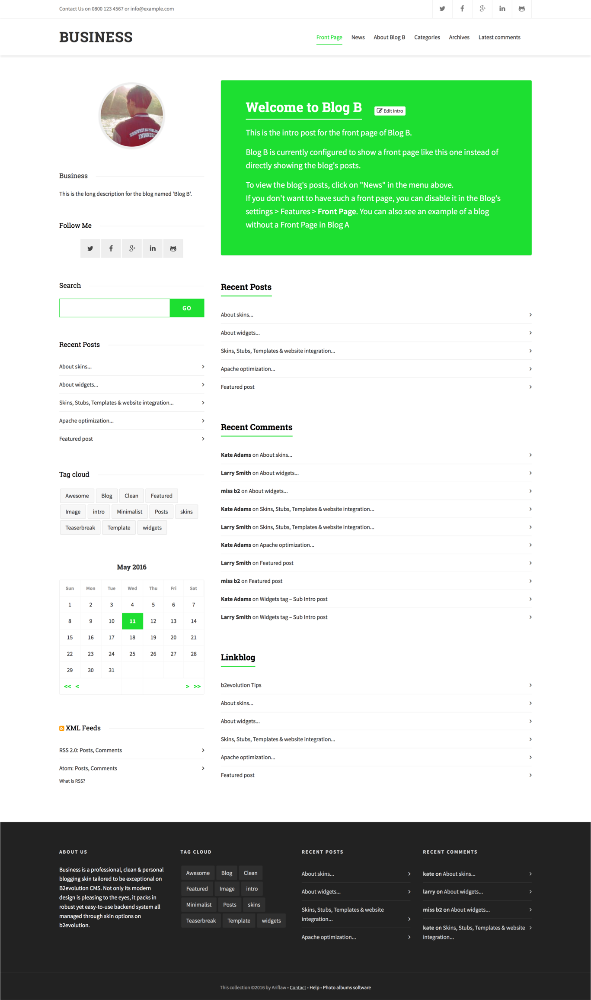

# Business Skin for b2evolution CMS v6

#### Business - Elegant and Clean Skin Blog

Business is a professional, Clean & Personal Blogging Skin tailored to be exceptional on b2evolution CMS. Not only its modern design is pleasing to the eyes, it packs in robust yet easy-to-use backend system all managed through skin options on b2evolution. Perfect choice for your personal blog, niche blog, corporate blog, marketing blog, authority blog or any type of creative blog or simple magazine.

It is highly customizable so it can match your personal taste. Enjoy Wellow’s Awesome features such as both sidebar & full-width layouts, a variety of post layout options, numerous sidebar & footer widgets, and plentiful colors, backgrounds and general skin options.

Get Business today and impress your readers! - <a href="https://github.com/b2evolution/business_skin/archive/master.zip">Download Now</a>

======
### Demo Skin
- Front Disp - <a href="http://skin.ariflaw.com/business/index.php/b/"><strong>Demo</strong></a>
- Posts Regular Disp - <a href="http://skin.ariflaw.com/business/"><strong>Demo</strong></a>
- Posts Mini Disp - <a href="http://skin.ariflaw.com/business/index.php/b/?disp=posts"><strong>Demo</strong></a>
- Single Disp - <a href="http://skin.ariflaw.com/business/index.php/a/typography-post"><strong>Demo</strong></a>
- Single Vimeo Post - <a href="http://skin.ariflaw.com/business/index.php/a/vimeo-post"><strong>Demo</strong></a>
- Single Image Post - <a href="http://skin.ariflaw.com/business/index.php/a/image-post"><strong>Demo</strong></a>
- Page Disp - <a href="http://skin.ariflaw.com/business/index.php/a/about-blog-a"><strong>Demo</strong></a>
- Comment Disp - <a href="http://skin.ariflaw.com/business/index.php/a/?disp=comments"><strong>Demo</strong></a>
- Search Disp - <a href="http://skin.ariflaw.com/business/index.php/a/?s=post&submit=Search&disp=search"><strong>Demo</strong></a>

======

### Front Page

### Posts Page

### Single Post Page

### Some of the Features:

- Fully Responsive Design
- Unlimited Color Schemes
- Top Bar Header Elements
- Smooth Sticky Top Bar with Logo
- Responsive Mobile Menu
- Full Width Elements
- Unlimited Sidebars Layout
- Standard Blog Layout
- Mini Blog Layout
- Full Post, Sidebar, and Grid
- List Layout Full Width
- Blog Layout Full Width
- Blog Masonry
- Blog Large Media
- Blog Small Media
- Back to top button
- Crossbrowser Compatible
- Free Updates and new features.
- Long-term Support

### Need Assistance? Get In Touch!

If you ever get stuck with setting up Business with your B2evolution installation, you can get in touch with our friendly and dedicated support via our <a href="http://forums.b2evolution.net/">Support Forum</a>.

### Changes & Updates

Version 1.0 – Initial Version – 05 January, 2016
